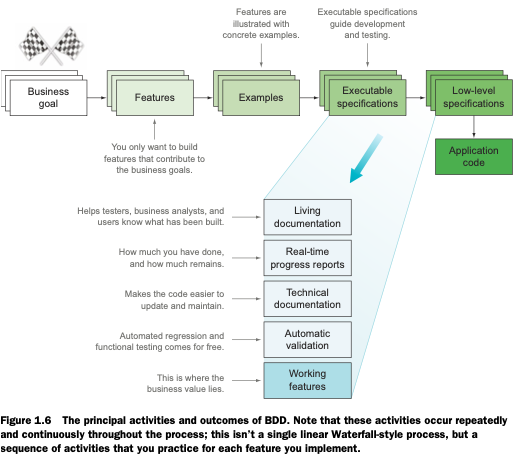

# Behavior-Driven-Development

## First Step
- Building software that makes a difference
  - BDD from 50,000 feet
  - What problems are you trying to solve?
  - Introducing the BDD
  
  - Benefits of BDD
  - Disadvantages and potential challenges of BDD
- BDD-the whirlwind tour
  - Introducing the train timetable application
  - Determining the value proposition of the application
  - Requirements analysis: Discovering and Understanding features
  - Implementation: Building and delivering features
  - Maintenance

## What Do I Want? Defining Requirements Using BDD
- Understanding the business goals: Feature Injection and related techniques
  - Introducing Flying High Airlines
  - Feature Injection
  - What do you want to achieve? Start with a vision
  - How will it benefit the business?
  - Who will benefit? Identify stakeholders and their needs
  - What do you need to build? Identify capabilities
  - What features will provide the most ROI?
- Defining and illustrating features
  - What is a feature?
  - Illustrating features with examples
  - Real Option: Don't make commitments before you have to
  - Deliverate Discovery
  - From Examples to working software: The Bigger Picture
- From examples to executable specifications
  - Truning examples into executable scenarios
  - Writing excutable scenarios
  - Using tables in scenarios
  - Expressive scenarios: Patterns and anti-patterns
  - Organizing scenarios using feature files and tags
- Automation the scenarios
  - Introduction to automating scenarios
  - Implementing step definitions: General principles
  - Implementing BDD more effectively with Thucydides(Serenity)
  - Automating scenarios in Java with JBehave
  - Automating scenarios in Java with Cucumber-JVM
  - Automating scenarios in Python with Behave
  - Automating scenarios in .NET with SpecFlow
  - Automating scenarios in JavaScript with Cucumber.js

## How Do I Build it? Coding the BDD way
- From executable specifications to rock-solid automated acceptance tests
  - Writing industrial-strength acceptance tests
  - Automating your test setup process
  - Separating the what from the how
- Automating acceptance criteria for the UI layer
  - When and how should you tet the UI
  - Automating web-based acceptance criteria using Selenium WebDriver
  - Using the Page Object pattern to encapsulate UI details
- Automating acceptance criteria for the Non-UI layer
  - Balancing UI and Non-UI tests
  - When to use Non-UI tests
  - Types of Non-UI tests
  - Defining and testing non-functional requirements
  - Discovering the design
- BDD and unit testing
  - BDD, TDD and unit testing
  - Going from acceptance criteria to implemented features
  - Exploring low-level requirements, discovering design, and implementing more complex functionality
  - Tools that make BDD unit testing easier
  - Using executable specifications as living documentation

## Taking BDD Further
- Living Documentation: Reporting and project management
  - Living documentation: A High-Level View
  - Are we there yet? Reporting on feature readiness and feature coverage
  - Integrating a digital product backlog
  - Organizing the living documentation
  - Providing more free-form documentation
  - Technical living documentation
- BDD in the build process
  - Executable specifications should be part of an automated build
  - Continuous integration speeds up the feeedback cycle
  - Continuous delivery: Any build is a potential release
  - Coninuous Integration used to deploy living documentation
  - Faster automated acceptance criteria